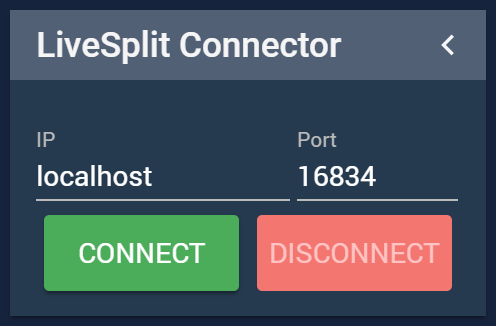

# NodeCG-LiveSplit


NodeCG-LiveSplit is a NodeCG bundle allows you to connect, send and recieve data using [LiveSplit.Server](https://github.com/LiveSplit/LiveSplit.Server).

## Requirements

- [Node.js 8 or greater (8 recommended, newer versions not tested)](https://nodejs.org/)
- [NodeCG v1.x](https://github.com/nodecg/nodecg)

## Installation

1. Clone (or download & extract) to `nodecg/bundles/nodecg-livesplit`.
2. Install `bower` if you have not already (`npm install -g bower`)
3. `cd nodecg/bundles/nodecg-livesplit` and run `npm install`, then `bower install`
4. Run the nodecg server: `node index.js` (or `nodecg start` if you have [`nodecg-cli`](https://github.com/nodecg/nodecg-cli) installed) from the `nodecg` root directory.

### Commands

There are two commands.
 - `livesplit:sendAction` This is for commands that do not return data
 - `livesplit:sendData` This is for commands that respond with data.

The actual commands to send to LiveSplit are documented [here](https://github.com/LiveSplit/LiveSplit.Server).


## Usage

Send Action
```
nodecg.sendMessageToBundle('livesplit:sendAction', 'nodecg-livesplit', 'starttimer');
```

Send Data
```
nodecg.sendMessageToBundle('livesplit:sendData', 'nodecg-livesplit', 'getsplitindex', (result) => {
	console.log(result);
});
```

### Example Bundle

Coming soon :)